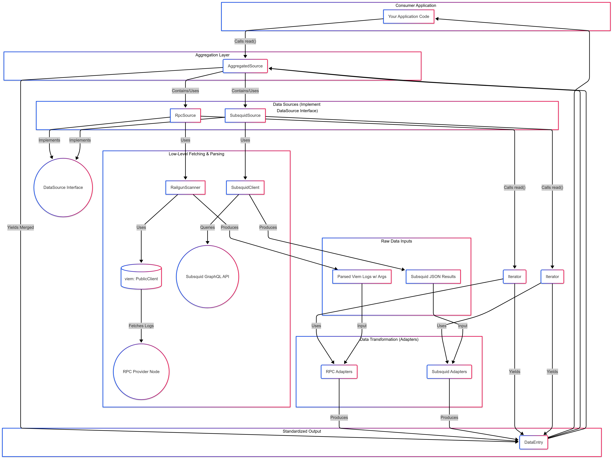

# RAILGUN Chain Sync

A modular data retrieval and processing system for RAILGUN events across various blockchain networks. This library provides a unified approach to fetching and aggregating RAILGUN-related events from multiple data sources.



## Overview

RAILGUN Chain Sync solves the challenge of efficiently retrieving and processing RAILGUN event data from blockchains. It provides:

- **Source-Agnostic Data Retrieval**: Standardized access to data from RPC nodes, Subsquid indexers, and other sources
- **Unified Data Format**: Common representation of all RAILGUN event types
- **Efficient Processing**: Asynchronous iterators for seamless consumption of ordered event streams
- **Flexible Aggregation**: Combine data from multiple sources with smart prioritization and deduplication

## Key Components

### Data Sources

The library implements multiple data sources through a common interface:

- **RPC Source**: Connects directly to blockchain nodes for real-time data
- **Subsquid Source**: Retrieves comprehensive indexed data from Subsquid
- **Aggregated Source**: Combines multiple sources with smart prioritization

Each source exposes a consistent async iterator interface, allowing consumers to process events in chronological order.

### Event Types

The system handles all RAILGUN event types:

- Nullifiers
- Commitments (Shield, Transact, CommitmentBatch, GeneratedCommitmentBatch)
- Unshields

### Data Flow

1. **Data Sources** connect to their respective endpoints and retrieve raw event data
2. **Adapters** transform source-specific data into standardized `DataEntry` objects
3. **Consumers** process these entries through async iterators
4. **Aggregator** (optional) combines entries from multiple sources with deduplication

## Architecture

### The `DataSource` Interface

Each data source implements:

- `head: bigint`: Latest known block number
- `syncing: boolean`: Source update status
- `read(height: bigint, eventTypes?: RailgunEventType[]): Promise<AsyncIterableIterator<DataEntry>>`: Core event retrieval method
- `destroy()`: Cleanup method

### The `DataEntry` Type

Standardized event representation with:

- Common metadata: `source`, `blockNumber`, `transactionHash`, `logIndex`, `blockTimestamp`
- `type`: Event type identifier
- `payload`: Event-specific data (nullifiers, commitments, etc.)

### Adapters

Translator layer that converts source-specific data formats into the standardized `DataEntry` format, handling:

- Type conversion
- Data normalization
- Format standardization

## Usage Example

```typescript
// Initialize a source
const subsquidSource = new SubsquidSource({
  network: "ethereum",
  batchSize: 100,
  eventTypes: [RailgunEventType.Shield, RailgunEventType.Nullifiers]
});

// Read events starting from a specific block
const iterator = await subsquidSource.read(10000000n);

// Process events using async iteration
for await (const entry of iterator) {
  console.log(`Event at block ${entry.blockNumber}: ${entry.type}`);
  
  if (entry.blockNumber > 10001000n) {
    break; // Stop after 1000 blocks
  }
}

// Clean up resources
subsquidSource.destroy();
```

## Current Status

The library currently supports:
- Complete implementation of RPC and Subsquid sources
- Adapters for all major RAILGUN event types
- Event aggregation with deduplication
- Standardized iterator pattern for consuming events

## Future Enhancements

1. **Performance Optimizations**: Improved batching and parallel processing
2. **Snapshot Support**: Fast synchronization from static data snapshots
3. **Reorg Handling**: Detection and recovery for chain reorganizations
4. **Verification**: On-chain Merkle root verification
5. **Transaction Reconstruction**: Higher-level service to group related events into complete RAILGUN transactions
